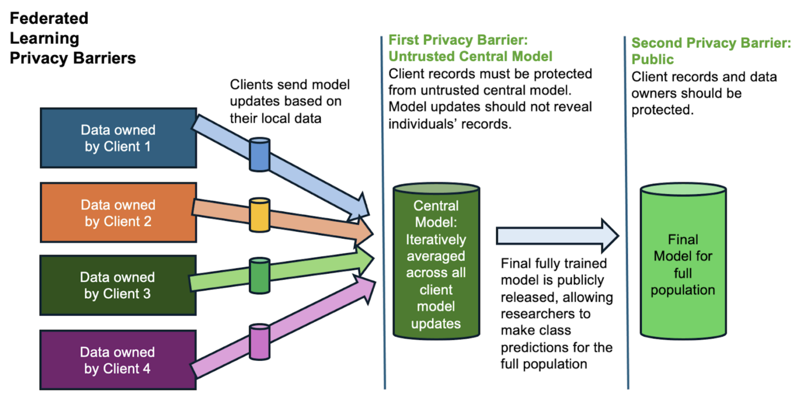
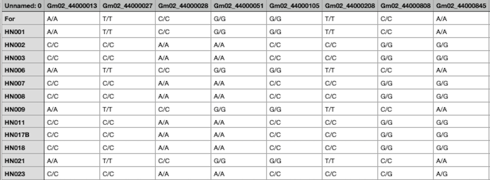
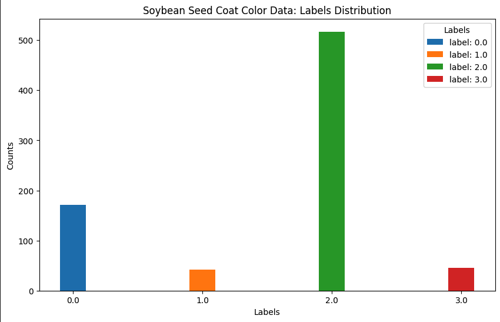
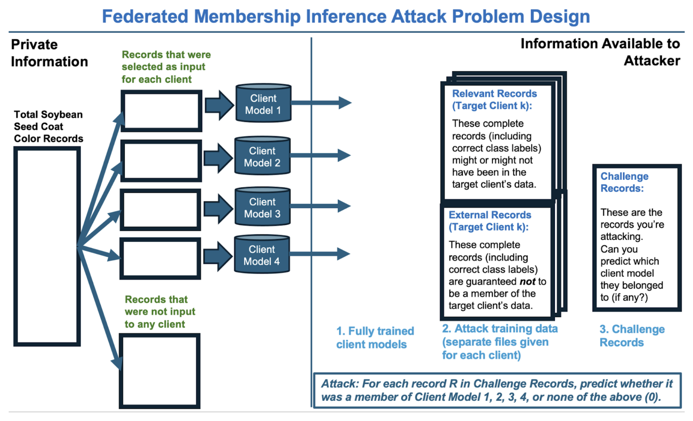

# Federated Learning Membership Inference Attack (MIA) Simulation

This [repository](https://github.com/rivera-lanasm/nist_ppfl/tree/master) contains code for training and executing a membership inference attack (MIA) against clients participating in a federated learning system. The scenario is based on the NIST Genomics Privacy-Preserving Federated Learning (PPFL) Challenge problem statement. It simulates adversarial behavior to assess the risk of exposing individual membership status in client datasets through model updates.

## Overview

This project addresses Phase 1 of the NIST Genomics Privacy-Preserving Federated Learning (PPFL) Challenge, targeting the first privacy barrier in the federated learning pipeline: the Untrusted Central Model.

In this scenario, clients train models locally on private genomic data and send updates to a central aggregator. While the federated setup is designed to protect individual privacy, the central model itself may be untrusted and adversarial.

The goal of this exercise is to simulate a membership inference attack from the perspective of an untrusted central aggregator. The attacker's objective is to determine whether a specific genomic record was part of a client’s training data — using only the client models and limited auxiliary data. This reflects a realistic privacy threat in settings where model updates may leak membership information.

Specifically, the project explores:
- Whether overtrained CNN client models are vulnerable to membership inference.
- Whether adding differential privacy (with high or low epsilon) can mitigate this risk.
- How these protections vary across clients with different data distributions.

The task is to train attack models for each client and predict the membership status of challenge records **under three privacy regimes**:
- CNN (no privacy)
- Low Privacy DP (ε = 200)
- High Privacy DP (ε = 10)

## How DP is applied in Federated Learning Model

To simulate privacy-preserving federated learning, some client models are trained with Differentially Private Stochastic Gradient Descent (DP-SGD). This algorithm ensures that each model update contributes limited information about any individual data point by introducing two key mechanisms:
- Gradient Clipping: Per-example gradients are computed and their L2 norms are clipped to a maximum of 2.0. This bounds the influence of any single record on the model update. This is typically used in training NNs as a form of regulurazation.
- Noise Addition: After clipping, Gaussian noise is added to the averaged gradients. The amount of noise is calibrated to achieve a specified privacy budget (ε), controlling the tradeoff between privacy and utility.

Two privacy settings are used:
- Low Privacy: ε = 200 — minimal noise, high utility, low privacy protection
- High Privacy: ε = 10 — stronger noise, reduced utility, better privacy guarantees

## Training Dataset For Classification Task

Each client model is trained to predict seed coat color in soybean plants using genomic variant data. The features are derived from a curated subset of gene variants most relevant to the prediction task. Here is a snapshot of the training data:

One thing to note is the high dimensionality of the data (about 200K dimensions). The gene expression categories being one-hot encoded contributes to this high dimensionality.

Here is a sample of the overall distribution of the classes the FL model setup tries to classify:

## Membership Inference Attack 

The goal of the MI attack by the federated learning central server is to determine whether a specific record was part of a client's private training data — without ever seeing that training data directly. This is done by training a binary attack model for each client that classifies records as members (in training set) or non-members (not in training set).

For each client:

Use the provided client model and provided records to train attack model:
- Relevant Records — a mix of true members and non-members
- External Records — guaranteed non-members

The attack training set consists of:
- Feeding both relevant and external records into the client model
- Using the model's predicted probabilities as input features
- Assigning binary labels:
    - 1 for relevant records (candidate members)
    - 0 for external records (non-members)

MembershipInferenceBlackBox, which trains an attack model that mimics black-box adversaries (e.g., using a logistic regression or MLP classifier internally)

**Intuition**
- Overfitted models often produce more confident predictions on training data. The attack model learns to distinguish these patterns by comparing model behavior on known non-members (external) vs. mixed data (relevant)

